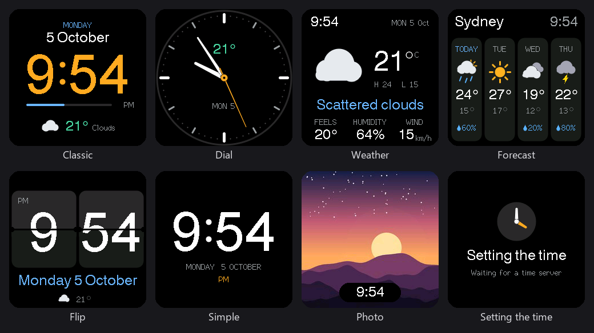

# SmartClock-OSS

Open replacement firmware for the "Smart Weather Clock" sold as **SD Pro**: a small
ESP8266 desk clock with a 240×240 IPS screen, and a GeekMagic-style clone. It is written
from scratch from a reverse-engineering of the stock firmware; no vendor code is reused.
You install it from the clock's own update page. No cables, soldering or opening the case
are needed.



## Features

- **Seven clock faces:** Classic, Dial, Weather, Forecast, Flip (with a fold
  animation), Simple, and Photo. Faces rotate automatically if you want them to, and
  skip any that have nothing to show yet.
- **Weather and a 4-day forecast with no API key**, from
  [Open-Meteo](https://open-meteo.com/). Type a city ("Sydney" or "Sydney, AU").
- **Correct local time all year**: time zones include daylight-saving rules.
- **Your photos**: the settings page crops and resizes them to 240×240 in your browser
  before uploading.
- **A modern settings page** for faces, colours, brightness, night dimming, time zone,
  weather, WiFi, photos and firmware updates. It works on phones and in dark mode, and
  needs no internet connection on the clock's setup network.
- **Password protected:** one password, shown on the clock, protects the settings page
  and the setup network.
- **Hard to brick:** firmware updates are checked before anything is written, the setup
  network is always on, and there is a recovery mode reached by power cycling. See
  [Recovery](#recovery).
- **Private:** no cloud account, no tracking, and WiFi passwords are never exposed by the
  web API (the stock firmware returned them in plain text).

## Supported devices

| Device | Status |
|---|---|
| "Smart Weather Clock" **SD Pro**, stock firmware V1.0.6 | Tested: installed from the stock update page and updated since |
| SD Pro, stock firmware V1.0.4 | Same flash layout as V1.0.6 (checked from the image); not tested on a device |
| GeekMagic SmallTV, SmallTV Ultra and other models | **Not supported.** Different boards and pin-outs |

Your clock's update page should say *"Please use the firmware of SD PRO"*. If it does not,
this firmware is not for your clock.

## Install

> **Read first.** Going back to the original firmware is not possible over WiFi. It needs a
> USB-serial adapter wired to the board. Keep the clock powered during the update. If
> something goes wrong after installing, see [Recovery](#recovery).

1. Download **`SDPro_SmartClockOSS_v<version>.bin`** from the
   [latest release](../../releases/latest). Keep the file name: the stock update page only
   accepts files whose names start with `SDP`.
2. Open the clock's web page in a browser (its IP address is shown on the clock when it
   starts), and find **Firmware Update (OTA)**.
3. Choose the downloaded file and press **Start Update**. Confirm, then wait for
   "Update Success". The clock restarts by itself within about 30 seconds.
4. On your phone or computer, join the WiFi network **Smart Weather Clock** with the
   password shown on the clock, and open **http://192.168.4.1/**. Sign in with the same
   password.
5. In the **WiFi** card, pick your network, enter its password, and press
   **Connect & restart**.
6. The clock shows its new address when it connects. Open that address in a browser to
   choose faces, set your city and time zone, and add photos.

The clock also announces itself as `smartclock-XXXXXX` (unique per clock) for mDNS
(`http://smartclock-XXXXXX.local/` from the same network) and in your router's list of
devices.

Later updates are installed from the **Firmware update** card on our settings page. It
accepts only SmartClock-OSS images and checks each one before writing.

## Recovery

- The **Smart Weather Clock** setup network stays on at all times, so you can always
  reach **http://192.168.4.1/**, even when your home WiFi is down or wrong.
- **Forgotten the password?** On the sign-in page, press **Show the password on the
  clock**, or use recovery mode below, which shows it on screen.
- **Recovery mode:** power the clock on for less than 10 seconds, twice, then power it on
  and leave it. The screen shows "Recovery". In recovery the setup network is open and
  no sign-in is needed. You can install firmware, and **Restart** returns to normal. The clock also enters recovery by itself if it crashes
  during startup.
- Settings and photos live in the clock's own storage and survive firmware updates.

More detail: [docs/MIGRATION.md](docs/MIGRATION.md).

## Known limitations

- The web page uses plain HTTP: someone already on your network can watch the traffic.
  The password stops them changing anything without it.
- Recovery mode (power cycling, or a crash during startup) is deliberately open.
- Animated GIFs are not played; the Photo face shows JPEGs.
- There is no way back to the stock firmware without a USB-serial adapter.

## Building from source

Requires [PlatformIO](https://platformio.org/).

```bash
pio run
```

The image is `.pio/build/esp12e/firmware.bin`. The build fails if the image would be too
large to update over the air (about 504 KB). Offline tests:

```bash
python tests/run_safety_tests.py
```

```bash
python tests/face_preview/run_face_preview.py
```

The first checks the update validation, recovery logic and flash layout. The second
renders every clock face to PNG on your computer and checks the screen-update logic.

For your own builds you can compile in fallback WiFi details: copy `secrets.example.ini`
to `secrets.ini` (git-ignored). Release images are built with
`python scripts/make_release.py`, which ignores `secrets.ini` and refuses to finish if the
image contains its values.

## Project documents

- [CHANGELOG.md](CHANGELOG.md): release history.
- [docs/STATUS.md](docs/STATUS.md): what has been shown on hardware.
- [docs/specifications/hardware.md](docs/specifications/hardware.md): hardware and pin map.
- [docs/specifications/stock-firmware-analysis.md](docs/specifications/stock-firmware-analysis.md):
  stock firmware analysis.
- [docs/decisions](docs/decisions/README.md), [docs/issues](docs/issues/README.md) and
  [docs/plans](docs/plans/README.md): design records, known issues and plans.

## Licence

SmartClock-OSS is free software under the [GNU General Public License v3.0](LICENSE).
Firmware images also contain third-party components under their own licences: the
ESP8266 Arduino core (LGPL-2.1), TFT_eSPI (FreeBSD/MIT), ArduinoJson (MIT) and ChaN's
TJpgDec (BSD-style). Weather data is provided by [Open-Meteo](https://open-meteo.com/)
under CC BY 4.0.

This project is not affiliated with GeekMagic or the makers of the SD Pro clock.

## Repository layout

```
platformio.ini        build and panel configuration
scripts/              build options (size guard, secrets) and the release script
include/pins.h        pin map
src/main.cpp          boot, recovery, WiFi, web API, updates
src/faces.cpp         the seven clock faces
src/weather.cpp       Open-Meteo geocoding, weather and forecast
src/config.h          settings stored on the clock (/config.json)
web/index.html        settings page (compressed into the firmware at build time)
tests/                offline safety tests and the face preview
docs/                 status, migration, specifications, decisions, issues, plans
```
